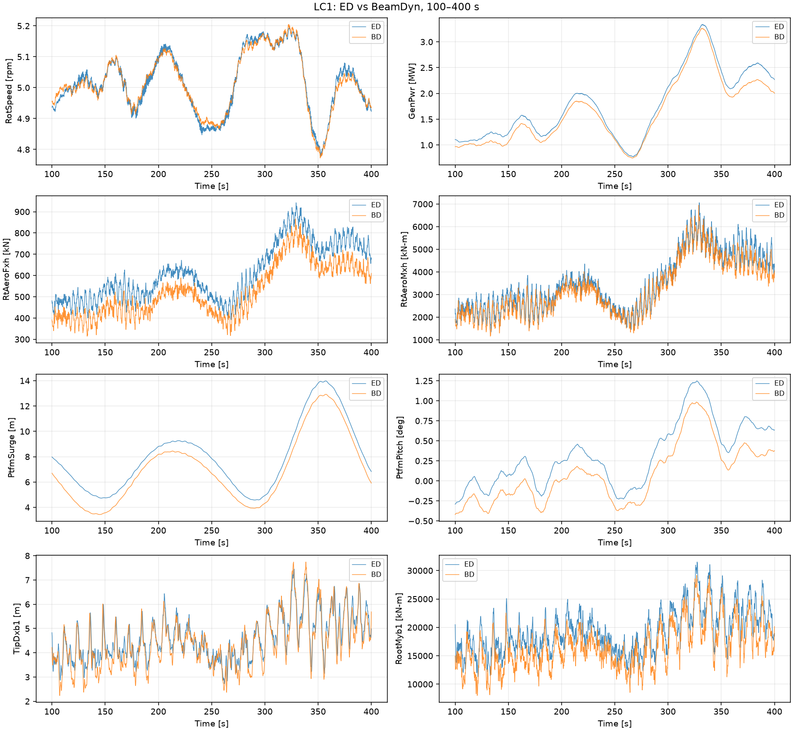
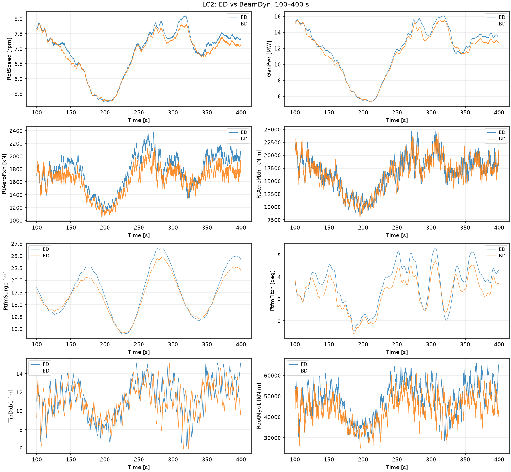
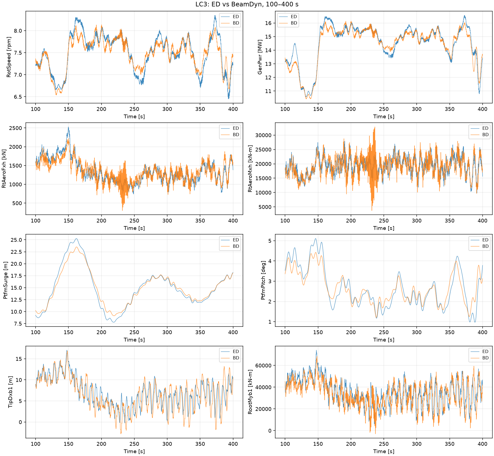
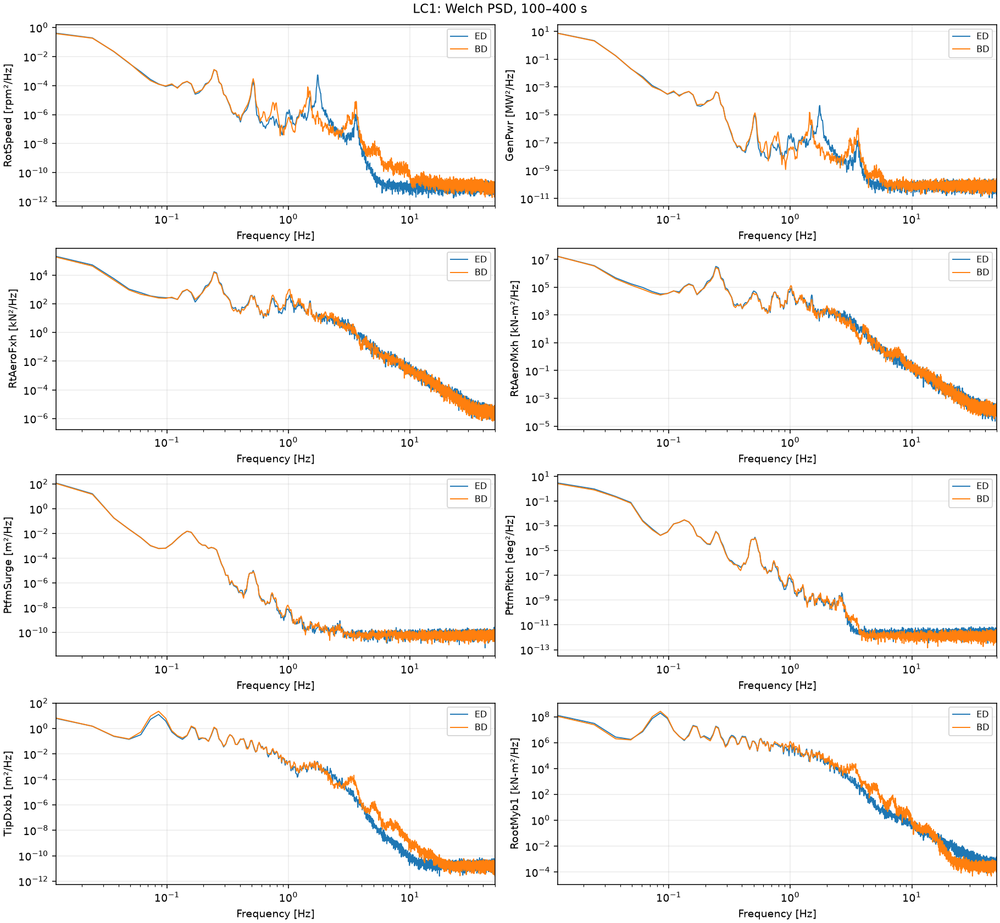
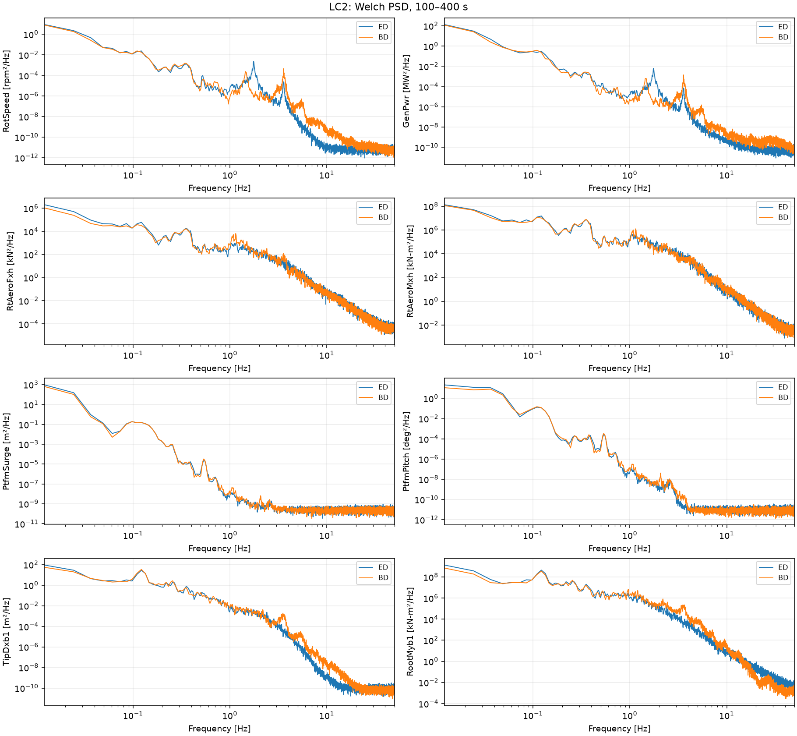
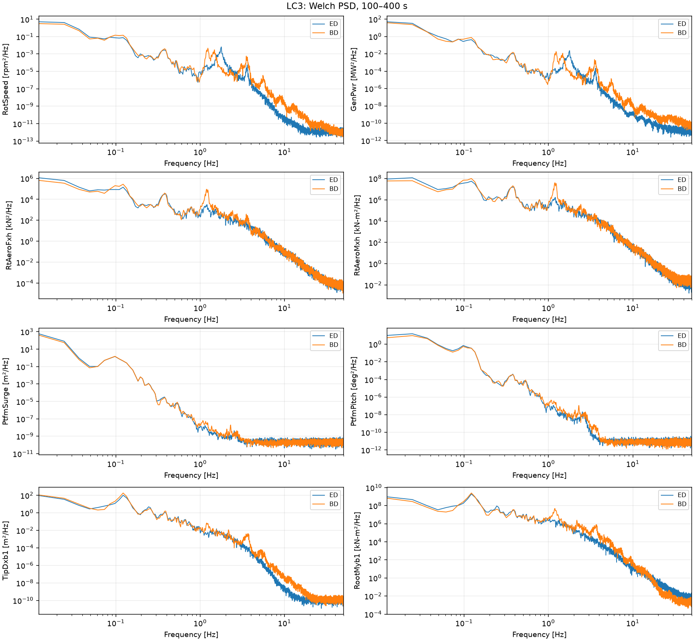

# ED–BeamDyn structural comparison: first post-processing stage

Source: the six completed v5 production runs mapped by `docs/structural_comparison_production_provenance.json`. This is a descriptive response comparison, not validation against measurements or a final identification dataset.

## Numerical completion and analysis validation

All six production runs reached 400 s with return code 0, zero tight-coupling failures, zero invalid-solution warnings and no fatal errors, per production provenance. Re-read OUTBs have 40001 samples from 0 to 400 s; each ED/BD time vector is exactly identical at 0.01 s spacing. Only t >= 100 s is selected (30001 samples). All matched full-length channels are finite; header units are asserted before conversion. Checksums match production provenance. All production files are hashed before and after processing.

## Physical response differences

41 physically matched channels are listed in `channel_map.csv`; all native channels and units are in `channel_inventory.csv`. See `channel_mapping.md` for blade frame, origin, sign and unit checks. Statistics use population standard deviation (ddof=0). RMS includes the mean. Differences are BD minus ED; relative percentages divide by |ED|. Mean ratios are suppressed when |ED mean| <= max(1e-9 engineering units, 10% ED RMS); CSV blanks and n/a denote suppression. Absolute mean differences remain available. Std/RMS ratios are suppressed for references <=1e-9. Large percentage changes in small-amplitude channels must be read alongside absolute values.

### LC1

| channel | unit | ed_mean | bd_mean | relative_mean_difference_pct | ed_std | bd_std | relative_std_difference_pct |
|---|---|---|---|---|---|---|---|
| GenPwr | kW | 1773.7 | 1640.5 | -7.5053 | 667.98 | 641.88 | -3.9079 |
| RotSpeed | rpm | 5.0163 | 5.0146 | -0.03415 | 0.098674 | 0.095859 | -2.8529 |
| RtAeroFxh | N | 6.1121e+05 | 5.246e+05 | -14.171 | 1.2957e+05 | 1.228e+05 | -5.2242 |
| RtAeroMxh | N-m | 3.5115e+06 | 3.2468e+06 | -7.5403 | 1.2381e+06 | 1.1889e+06 | -3.9743 |
| PtfmSurge | m | 7.9569 | 6.977 | -12.314 | 2.6437 | 2.6711 | 1.0382 |
| PtfmPitch | deg | 0.31803 | 0.084944 | -73.291 | 0.39402 | 0.36809 | -6.5797 |
| TipDxb1 | m | 4.5922 | 4.4081 | -4.0083 | 0.90456 | 1.0315 | 14.036 |
| RootMyb1 | kN-m | 19387 | 16651 | -14.112 | 3830.8 | 3844.3 | 0.35191 |



### LC2

| channel | unit | ed_mean | bd_mean | relative_mean_difference_pct | ed_std | bd_std | relative_std_difference_pct |
|---|---|---|---|---|---|---|---|
| GenPwr | kW | 11732 | 11385 | -2.9544 | 3160.8 | 2970.8 | -6.0126 |
| RotSpeed | rpm | 6.8976 | 6.8019 | -1.3881 | 0.79001 | 0.73312 | -7.2017 |
| RtAeroFxh | N | 1.7631e+06 | 1.6295e+06 | -7.5809 | 2.7398e+05 | 2.2343e+05 | -18.453 |
| RtAeroMxh | N-m | 1.6585e+07 | 1.6329e+07 | -1.5416 | 3.299e+06 | 3.1664e+06 | -4.0193 |
| PtfmSurge | m | 17.55 | 16.831 | -4.0939 | 5.0108 | 4.1789 | -16.603 |
| PtfmPitch | deg | 3.6317 | 3.2733 | -9.868 | 0.96289 | 0.78274 | -18.709 |
| TipDxb1 | m | 11.339 | 11.09 | -2.1919 | 1.976 | 1.7053 | -13.703 |
| RootMyb1 | kN-m | 48599 | 43839 | -9.7945 | 8274.3 | 6834.9 | -17.396 |



### LC3

| channel | unit | ed_mean | bd_mean | relative_mean_difference_pct | ed_std | bd_std | relative_std_difference_pct |
|---|---|---|---|---|---|---|---|
| GenPwr | kW | 14510 | 14406 | -0.71237 | 1427.4 | 1387.4 | -2.8029 |
| RotSpeed | rpm | 7.4966 | 7.4777 | -0.25268 | 0.42231 | 0.35359 | -16.272 |
| RtAeroFxh | N | 1.3456e+06 | 1.3372e+06 | -0.62697 | 3.1674e+05 | 2.7387e+05 | -13.533 |
| RtAeroMxh | N-m | 1.9231e+07 | 1.9149e+07 | -0.4224 | 2.9946e+06 | 3.5232e+06 | 17.651 |
| PtfmSurge | m | 14.928 | 14.943 | 0.099871 | 4.3247 | 3.6117 | -16.488 |
| PtfmPitch | deg | 2.6621 | 2.653 | -0.34092 | 0.99272 | 0.76304 | -23.137 |
| TipDxb1 | m | 6.9378 | 6.4438 | -7.121 | 3.416 | 3.7987 | 11.202 |
| RootMyb1 | kN-m | 35703 | 33399 | -6.454 | 11991 | 11565 | -3.5529 |



### Largest cross-condition standard-deviation changes

| lc | channel | unit | ed_std | bd_std | relative_std_difference_pct | absolute_mean_difference |
|---|---|---|---|---|---|---|
| LC3 | YawBrFzp | kN | 148.69 | 205.1 | 37.935 | 43.089 |
| LC2 | BldPitch3 | deg | 2.1344 | 1.4278 | -33.103 | 0.78871 |
| LC2 | BldPitch2 | deg | 2.1344 | 1.4278 | -33.103 | 0.78871 |
| LC2 | BldPitch1 | deg | 2.1344 | 1.4278 | -33.103 | 0.78871 |
| LC2 | YawBrFzp | kN | 101.54 | 125.13 | 23.226 | 55.358 |
| LC3 | PtfmPitch | deg | 0.99272 | 0.76304 | -23.137 | 0.0090754 |
| LC2 | RootMyb3 | kN-m | 8421.8 | 6551 | -22.214 | 5070.8 |
| LC2 | RootMyb2 | kN-m | 8506.9 | 6708.2 | -21.144 | 4990.5 |
| LC2 | TipDxb3 | m | 2.0558 | 1.6508 | -19.7 | 0.31101 |
| LC2 | TipDxb2 | m | 2.0759 | 1.6679 | -19.656 | 0.31584 |

### Largest mean changes with meaningful ED references

| lc | channel | unit | ed_mean | bd_mean | absolute_mean_difference | relative_mean_difference_pct |
|---|---|---|---|---|---|---|
| LC2 | TipDyb3 | m | -0.3416 | -0.88908 | 0.54748 | -160.27 |
| LC2 | TipDyb1 | m | -0.34767 | -0.89033 | 0.54266 | -156.09 |
| LC2 | TipDyb2 | m | -0.3512 | -0.87871 | 0.52751 | -150.2 |
| LC1 | PtfmPitch | deg | 0.31803 | 0.084944 | 0.23308 | -73.291 |
| LC1 | PtfmYaw | deg | 0.31494 | 0.53439 | 0.21946 | 69.683 |
| LC1 | YawBrMzp | kN-m | 1550.8 | 2510.1 | 959.25 | 61.853 |
| LC1 | TTDspFA | m | -0.0443 | -0.066317 | 0.022017 | -49.699 |
| LC2 | PtfmSway | m | 0.75144 | 0.48005 | 0.27138 | -36.115 |

LC1 shows the largest mean changes among the priority channels: generator power falls 7.51%, aerodynamic thrust 14.17%, and platform pitch from 0.318 to 0.0849 deg (an absolute change of 0.233 deg). LC2 thrust and blade-1 flapwise root moment means fall 7.58% and 9.79%; platform-pitch std falls 18.71%. LC3 priority-channel means are closer, while platform-pitch std falls 23.14% and blade-1 tip-x std rises 11.20%. The largest std increase across all matches is LC3 YawBrFzp (+37.93%); the largest reduction is LC2 collective blade pitch (-33.10%). Small-reference edgewise mean ratios are suppressed; their absolute changes remain in statistics.csv.

## Spectral description

Descriptively, 0<f<=2 Hz band power is lower in BD for LC2 thrust (-42.07%), platform pitch (-39.95%) and surge (-31.95%). Blade-1 tip-x band power rises 45.64% in LC1 and 40.76% in LC3. LC3 aerodynamic-torque band power rises 42.51%, and its maximum bin changes from 0.0244 Hz (ED) to 0.1221 Hz (BD). LC1 blade-tip and root-flapwise maxima share 0.08545 Hz; LC3 shares 0.1221 Hz. Many other maxima sit at the first resolved bin (0.01221 Hz), indicating dominant low-frequency content with limited resolution. These are finite-window descriptions, without attributing peaks to structural modes. Band-power changes need not equal full-window variance changes because Welch detrends each segment and weights its samples.

Sampling frequency 100 Hz; Welch one-sided density, periodic Hann window; 8192 samples (81.92 s) per segment, 4096 samples (50%) overlap, six complete segments, constant detrending per segment, arithmetic averaging, no zero padding. Frequency resolution 100/8192 = 0.01220703125 Hz; Nyquist 50 Hz. Identical parameters are applied to ED and BD. The unused final 1329 samples are retained in time statistics; Welch uses complete segments. Full 0–50 Hz spectra are saved in `psd.csv.gz`. The table describes the maximum PSD bin and integrated power within 0<f<=2 Hz, not mode identification or a claim about narrow peaks.

| lc | channel | ed_peak_hz | bd_peak_hz | band_power_difference_pct |
|---|---|---|---|---|
| LC1 | RotSpeed | 0.012207 | 0.012207 | -5.8891 |
| LC1 | GenPwr | 0.012207 | 0.012207 | -2.9832 |
| LC1 | RtAeroFxh | 0.012207 | 0.012207 | -9.659 |
| LC1 | RtAeroMxh | 0.012207 | 0.012207 | -6.4588 |
| LC1 | PtfmSurge | 0.012207 | 0.012207 | -7.5878 |
| LC1 | PtfmPitch | 0.012207 | 0.012207 | -13.009 |
| LC1 | TipDxb1 | 0.085449 | 0.085449 | 45.644 |
| LC1 | RootMyb1 | 0.085449 | 0.085449 | 11.945 |
| LC2 | RotSpeed | 0.012207 | 0.012207 | -13.641 |
| LC2 | GenPwr | 0.012207 | 0.012207 | -13.478 |
| LC2 | RtAeroFxh | 0.012207 | 0.012207 | -42.07 |
| LC2 | RtAeroMxh | 0.012207 | 0.012207 | -10.28 |
| LC2 | PtfmSurge | 0.012207 | 0.012207 | -31.952 |
| LC2 | PtfmPitch | 0.012207 | 0.012207 | -39.949 |
| LC2 | TipDxb1 | 0.012207 | 0.012207 | -16.286 |
| LC2 | RootMyb1 | 0.012207 | 0.012207 | -30.851 |
| LC3 | RotSpeed | 0.012207 | 0.012207 | -32.95 |
| LC3 | GenPwr | 0.012207 | 0.012207 | -23.049 |
| LC3 | RtAeroFxh | 0.012207 | 0.012207 | 3.6809 |
| LC3 | RtAeroMxh | 0.024414 | 0.12207 | 42.513 |
| LC3 | PtfmSurge | 0.012207 | 0.012207 | -30.054 |
| LC3 | PtfmPitch | 0.024414 | 0.024414 | -34.751 |
| LC3 | TipDxb1 | 0.12207 | 0.12207 | 40.762 |
| LC3 | RootMyb1 | 0.12207 | 0.12207 | 6.9604 |







## Remaining AeroDyn / ROSCO validity warnings

Numerical completion does not establish physical validity. Recorded axial-induction and UA-disabled warnings occur in all runs; Mach warnings occur in all except LC1_ED. BD has Bladed-interface warnings in all three conditions. LC1 ED and BD each record two ROSCO estimator warnings with fallback to filtered hub-height wind speed. Warning repeat suppression does not show recovery. BD close-node mesh mapping notices occur at initialization; missing MoorDyn object IDs and skipped AeroDyn nodal channels are initialization notices. Invalid MoorDyn outputs are excluded. See the authoritative production execution report for counts; this stage changes no configuration.

## Computational cost

Recorded solver subprocess wall times, separate from response differences:

| lc | ed_wall_s | bd_wall_s | bd_over_ed |
|---|---|---|---|
| LC1 | 249.66 | 782.65 | 3.1349 |
| LC2 | 273.67 | 957.04 | 3.4971 |
| LC3 | 262.91 | 1237.2 | 4.7059 |

## Reproduction

From the repository root:

```sh
.venv/bin/python analysis/structural_comparison/analyze.py
```

Requires the existing project dependencies (NumPy, pandas, matplotlib); no solver is invoked. Optional `--raw-dir` and `--output-dir` arguments support relocated inputs and results. Only analysis products are written. Raw 0–400 s outputs, logs, inputs and campaign files are preserved; no final identification dataset is created.
