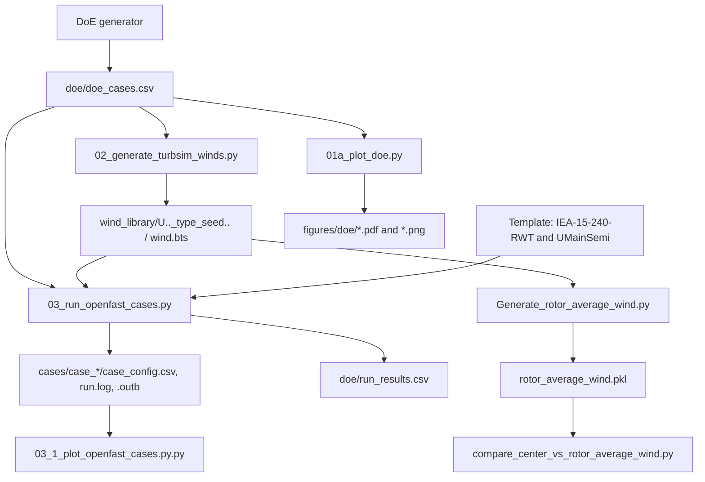
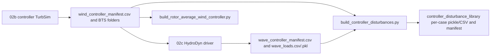

# Legacy workflow audit

## Scope and evidence

This is an audit of `/home/sebastiano/projects/DatasetIdentification` as inspected on 2026-09-30.  Statements labelled **observed** come from its checked files; proposed package locations are explicitly prospective. No legacy script or scientific configuration was changed for this audit.

The legacy repository has a main campaign pipeline, an independent controller/ROM disturbance-library pipeline, a controller tuning sweep, and a free-decay validation path. The numbered scripts are useful clues, but they are not the complete workflow.

## Observed main campaign

The existing `doe/doe_cases.csv` has the 13-column schema emitted by `01_generate_doe.py`, so it is the strongest on-disk evidence for the currently consumed main-campaign DoE. `03_run_openfast_cases.py` requires its legacy columns (`wind_seed_index`, `wave_seed_index`, etc.); it is not compatible without adaptation with the richer split generator, which lacks those two index columns.

| Script / component | Observed responsibility | Inputs | Outputs / status |
|---|---|---|---|
| `scripts/01_generate_doe.py` | Small, fixed DoE | hard-coded DLC tables/controllers | `doe/doe_cases.csv`; observed compatible with current file |
| `scripts/generate_doe_dataset_splits.py` | Rich configurable IEC-like DoE and summary | hard-coded options/tables | `doe_cases.csv`, `doe_summary.csv`; likely newer experiment |
| `scripts/generate_doe_dataset_splits_compatible.py` | Expanded DoE retaining old 13-column default schema | hard-coded tables/splits | `doe_cases.csv`; compatibility-oriented alternative |
| `scripts/01a_plot_doe.py` | DoE environment diagnostic | DoE CSV | `figures/doe/{training,validation-or-test}_cases_environment.{pdf,png}` |
| `scripts/02_generate_turbsim_winds.py` | Generate unique campaign wind fields | DoE CSV, `wind/TurbSim.inp`, TurbSim executable | `wind_library/U##_<type>_seed####/{TurbSim.inp,turbsim.log,wind.bts}` |
| `scripts/03_run_openfast_cases.py` | Copy templates, link wind, patch inputs, tune ROSCO, run OpenFAST | DoE CSV, templates, wind library, OpenFAST/ROSCO | `cases/case_*/`, `.outb`, `doe/run_results.csv` |
| `scripts/03_1_plot_openfast_cases.py.py` | interactive response/mooring diagnostics | selected case `.outb` | interactive plots only |
| `Generate_rotor_average_wind.py` | rotor-disc average every campaign BTS | `wind_library/*/wind.bts` | per-wind `rotor_average_wind.pkl` |
| `compare_center_vs_rotor_average_wind.py` | diagnostic comparison of centre and disc wind | BTS plus rotor-average pickle | per-wind PNG diagnostics |
| `Quick_Post_Processing.py` | older direct-output overlay | assumes a different flat case layout | interactive plot; appears stale relative to nested `cases/case_*/...` layout |
| `Main.py` | controller-frequency sweep with ROSCO tuning | separate template paths | copied cases and OpenFAST runs; separate experiment |
| `Controller_Tuning/Tune_Controller.py` | one-off ROSCO DISCON generation | ROSCO YAML and model files | `DISCON.IN` |

### Campaign case preparation details

**Observed:** the campaign runner copies `Template/IEA-15-240-RWT-UMaineSemi` and `Template/IEA-15-240-RWT` into every case, symlinks the selected BTS to `IEA-15-240-RWT/Wind/wind.bts`, changes InflowWind `WindType=3` and `FileName_BTS="Wind/wind.bts"`, and changes SeaState `WaveHs`, `WaveTp`, and `WaveSeed(1)`. It changes ROSCO YAML `omega_pc` from the DoE and fixes `zeta_pc=0.8`, then loads the YAML through ROSCO, tunes the controller, and writes `IEA-15-240-RWT-UMaineSemi_DISCON.IN`.

The runner itself does not patch `TMax`, `DT`, output channels, wave direction/model, or a second wave seed. Those settings therefore remain template-controlled. It uses 14 worker processes by default, deletes/rebuilds an existing case directory, and captures OpenFAST stdout/stderr in `run.log`.

## DoE generators: do not merge yet

All three overwrite the same nominal `doe/doe_cases.csv`, but their population, seeds, names, fields, and controller values differ materially.

| Property | `01_generate_doe.py` | `generate_doe_dataset_splits.py` | `generate_doe_dataset_splits_compatible.py` |
|---|---|---|---|
| Default winds | DLC11/16: 10,14,18,22; DLC13 validation: 12,16,20 m/s | practical: 6..24 m/s except 4, three DLCs | 6,8,10,12,14,16,18,22 m/s, three DLCs |
| DLCs / turbulence labels | DLC11 NTM, DLC16 NTM, DLC13 `1ETM` | DLC11 NTM, DLC13 `ETM`, DLC16 NTM; DLC14 ECD optional/off | DLC11 NTM, DLC13 `1ETM`, DLC16 NTM |
| Default split | train seed indices 1--4 for DLC11/16; validation 1--3 only for DLC13 | seed-proportional: train 1,2; validation 3; test 4 | train 1,2,3; validation 4; test 5 |
| Optional split | none | full IEC level and wind-holdout option | comments provide alternate full wind list only |
| Case IDs | four digits; generation order | five digits, then sorted/renumbered | four digits; split/DLC/grid order |
| Seed algorithm | TurbSim `100000+index`; wave `-500000000+(index+1000)` | CRC32 over final case name/split/index; positive TurbSim and negative wave seeds | same simple algorithm as `01_generate_doe.py` |
| Controllers | below rated baseline `omega_pc=0.20`; above: 0.05/0.10/0.15 | below `baseline_below=0.20`; above `soft=0.04`, `baseline=0.8`, `aggressive=0.12` (preserve exactly; possible typo is not corrected) | below baseline=0.20; above 0.05/0.10/0.15 |
| CSV contract | 13 legacy columns | rich metadata, no `wind_seed_index` / `wave_seed_index`, plus `doe_summary.csv` | 13 legacy columns by default; optional extra metadata |
| Sea tables | compact hard-coded values | normal/severe tables including gamma; severe values differ at several speeds | normal/severe tables including `Gamma`; severe 8/10 m/s entries differ from rich generator |

**Interpretation:** only `01_generate_doe.py` is directly evidenced as the current campaign source by the checked-in legacy CSV. The two split generators are alternatives/experiments, not safe replacements. Human confirmation is required before naming one canonical.

## Independent controller/ROM workflow

`02b_generate_wind_controller_turbsim.py` is intentionally independent of the DoE. It enumerates U=10--22 m/s, NTM classes A/B/C plus ETM class B, seed indices 1--6, with deterministic `RandSeed1=100000+10000*turbulence_case_id+10*round(10U)+seed_index`. It uses the same 11x11, 300 m x 300 m, hub/reference height 150 m, 0.1 s and 1000 s TurbSim geometry/time settings as the campaign wind script, but varies `IECturbc`.

`02c_generate_wave_controller_hydrodyn.py` consumes successful controller-wind manifest rows, patches copied HydroDyn/SeaState templates, and invokes the standalone HydroDyn driver. It maps U=10--22 to its own Hs/Tp table, uses `WaveMod=2`, direction 0 degrees, 0.1 s and 1000 s, and derives two wave seeds from the TurbSim seed. It writes raw and demeaned `Fwave_x`/`Mwave_y`; default ROM selection is raw. The checked manifest confirms 10,001 samples for a 1000 s / 0.1 s execution. The script’s docstring itself calls the Hs/Tp values “practical default values”, so this table must be approved before scientific use.

`build_rotor_average_wind_controller.py` and `build_controller_disturbances.py` duplicate BTS reading/masking logic. Both use rotor radius 120 m and hub `(y,z)=(0,150)` m. The latter interpolates waves to wind time by default and serializes `d=[Vwind_x,Vwind_z,Fwave_x,Mwave_y]` as float32, plus metadata/manifests. `Generate_rotor_average_wind.py` provides an older campaign-only pickle variation; `compare_center_vs_rotor_average_wind.py` and `Generate_GIF_Wind.py` are diagnostics/visualization auxiliaries.

## Free-decay validation

`04_Free_Decay_Validation_Test.py` is a separate sequential two-case OpenFAST workflow. It creates `free_decay_surge_30m` with initial surge 20 m and `free_decay_pitch_10deg` with initial pitch 5 degrees (names do not equal configured magnitudes). It sets `TMax=1000`, `DT_Out=0.05`, `CompAero=0`, `CompServo=0`, retains HydroDyn/SeaState, sets zero-steady wind (`CompInflow=1`, `WindType=1`, `HWindSpeed=0.001`, `RefHt=150`, `PLexp=0`) and sets `WaveMod=0`, `WaveHs=0`, `WaveTp=10`. It also writes quiet rotor/initial platform conditions and disables ServoDyn modes if that file remains relevant. Output is `free_decay_cases/free_decay_results.csv` plus copied cases and OpenFAST outputs.

## External dependencies and environment assumptions

| Dependency | Observed use |
|---|---|
| OpenFAST executable | full case execution and free decay at `~/projects/openfast/build/glue-codes/openfast/openfast` |
| TurbSim executable | campaign and controller BTS generation at `~/projects/openfast/build_turbsim/modules/turbsim/turbsim` |
| HydroDyn driver | controller wave library at `~/projects/openfast/build/modules/hydrodyn/hydrodyn_driver` |
| ROSCO Python toolbox | YAML loading, turbine loading, tuning, DISCON writing |
| `openfast_toolbox` or `pyFAST` | `.outb` and `.bts` reading |
| NumPy, pandas, matplotlib | generation, tabular outputs, diagnostics |
| LaTeX / Computer Modern | required by `01a_plot_doe.py` (`text.usetex=True`) |

The scripts assume Linux/WSL paths, POSIX symlinks, and executables built in sibling `~/projects` repositories. They use `Path.home()/projects/...` throughout; `Quick_Post_Processing.py` additionally embeds `/home/sebastiano/projects/DatasetIdentification/cases`. No credentials were observed.

## Scientific invariants for a future migration

Do not change any of the following without an explicit approved baseline selected per workflow:

- exact DoE rows, ordering/case IDs, split membership, schema, column spelling/case, units, turbulence labels, and seed algorithms;
- every normal/severe sea-state table value, gamma/Gamma field convention, controller family/ID, `omega_pc`, and `zeta_pc=0.8` used by the campaign runner;
- TurbSim grid (11x11; 300 m width/height; hub/reference height 150 m), `TimeStep=0.1`, `AnalysisTime=1000`, `UsableTime=ALL`, `IECKAI`, `RandSeed2=RanLux`, and turbulence-class policy;
- case-directory and wind-directory naming, BTS link target/name, copied-template topology, and legacy 13-column compatibility contract;
- template-owned OpenFAST parameters/channels and module settings unless a template snapshot is baselined; the runner only changes the fields documented above;
- standalone HydroDyn output channels, force/moment sign and coordinate conventions, wave U-to-Hs/Tp mapping, `WaveMod`, wave seeds, raw-versus-demeaned selection, and time alignment/interpolation behavior;
- rotor average geometry/mask and output signal ordering/types; and
- free-decay initial conditions, module disablement, duration, output time step, and zero-wind/wave choices.

## Proposed mapping to this repository

This section is a proposal, not a migration.

| Target | Proposed responsibility |
|---|---|
| `src/openfast_dataset/doe/` | isolated legacy DoE profiles and schema/seed utilities; do not choose canonical profile before approval |
| `src/openfast_dataset/wind/` | TurbSim input rendering/execution and BTS reading/rotor averaging |
| `src/openfast_dataset/waves/` | SeaState/HydroDyn rendering, driver execution, and wave-load parsing |
| `src/openfast_dataset/cases/` | template copying, OpenFAST text patching, ROSCO DISCON preparation, runner/status collection |
| `src/openfast_dataset/controller_dataset/` | controller wind/wave manifests and combined disturbance cases |
| `src/openfast_dataset/validation/` | free-decay case construction and diagnostic readers |
| `src/openfast_dataset/utils/` | shared label-aware text patching, naming, manifest, and process helpers |
| `configs/` | versioned non-secret scientific profiles plus ignored machine path config; template checksums/version metadata should be recorded |
| `scripts/` | thin CLIs only |
| `tests/` | golden CSV/manifest/input-file snapshots and non-executable unit tests |
| `data/` | curated small golden DoE/manifests only |
| `outputs/` | all rendered inputs, BTS, cases, logs, `.outb`, plots, and generated libraries (ignored) |

The current repository has directory placeholders for these modules and only configuration/path loading plus a deliberately `NotImplemented` DoE stub. Its `configs/doe.yaml` values (`seed: 42`, 1200 s, 0.01 s) are explicitly unreconciled and must not be treated as a legacy replacement.

## Open questions requiring confirmation

1. Which DoE artifact is the scientific baseline: the currently present 13-column CSV / `01_generate_doe.py`, the compatibility generator, or the richer split generator?
2. Is `omega_pc=0.8` in `generate_doe_dataset_splits.py` intentional (it differs by roughly an order of magnitude from the other generators)?
3. Should DLC13 use `ETM` or `1ETM` for the target TurbSim/OpenFAST version?
4. Which template revision and OpenFAST/ROSCO versions generated the validated data? Template-controlled channels/duration/DT cannot be inferred safely from the Python runner alone.
5. Is the controller/ROM wave table provisional as its comments state, or a validated scientific table? Should it use DoE sea states instead?
6. Are controller-library TurbSim failures in the existing manifest expected/environmental, and which successful manifest/version is the reference?
7. Should final post-processing include only rotor/wave disturbance libraries, or is there an unlocated OpenFAST-output-to-training-data stage outside this project?
8. Are the free-decay case names historical labels despite their configured 20 m and 5 degree initial conditions?
